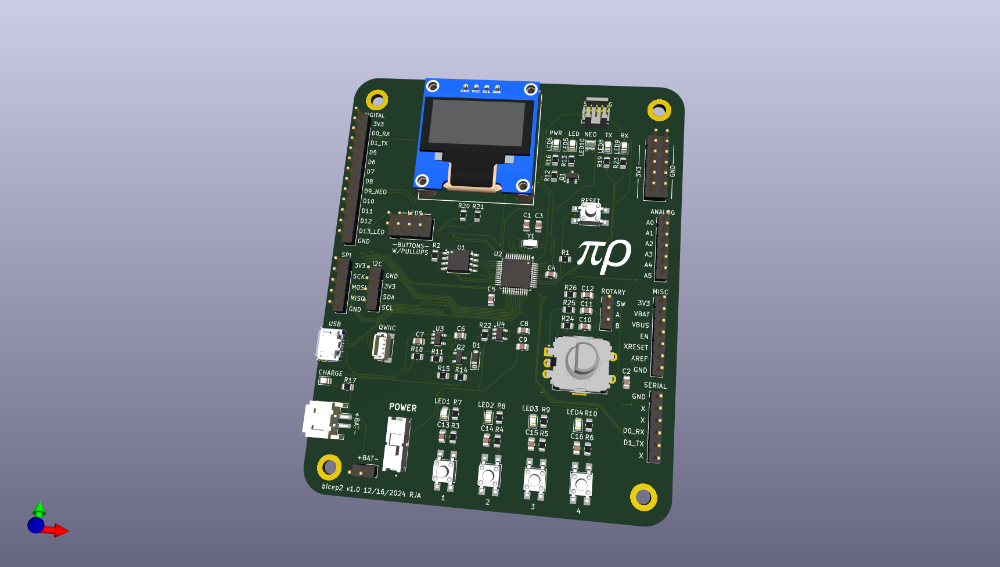

# Bicep2 - Flexing my "ARM" muscles

This is a simple ARM Cortex M0 development board with:
* SAMD21G18A cpu
* 0.96" OLED I2C display
* LiPo battery
* 2 I2C connectors (1 QWIIC and 1 header)
* 1 extra serial connector
* 1 rotary switch
* 4 pushbuttons
* 4 LEDs
* 1 neopixel LED
* 2 MB SPI flash

This is designed for prototyping.
I find that almost every time I'm trying new hardware I need some combination of LEDs, buttons, rotary switch, or an OLED display.
The display is connected to the I2C bus and can be disconnected by removing the jumper resistors.
The switches and LEDs can be connected to digital pins with jumper wires.

The SPI flash enables using the same bootloader as the adafruit feather m0 express.  This memory is typically used for CircuitPython but can also be used for general storage.

[Schematic pdf](v1.0/bicep2.pdf)

